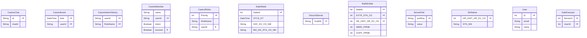

```mermaid
erDiagram

  "CasinoChat" {
    String id "🗝️"
    String chatId 
    }
  

  "CasinoEvent" {
    DateTime time "🗝️"
    String userId "🗝️"
    }
  

  "CasinoInternHistory" {
    String userId "🗝️"
    String RoleName "🗝️"
    }
  

  "CasinoMember" {
    String name 
    String userId "🗝️"
    Boolean intern 
    Boolean exeJoin "❓"
    }
  

  "CasinoRoles" {
    Int Priority "🗝️"
    String RoleName 
    String userId "❓"
    }
  

  "DateWeek" {
    Int DateId "🗝️"
    DateTime STCS_DT 
    String DAY_DV_CD_NM 
    String BIZ_DD_STG_CD_NM 
    }
  

  "DiscordServer" {
    String GuildId "🗝️"
    }
  

  "RailStnStat" {
    Int DateId "🗝️"
    Int EXTR_STN_CD "🗝️"
    Int HR_UNIT_HR_DV_CD "🗝️"
    Int ABRD_PRNB 
    Int GOFF_PRNB 
    }
  

  "ServerPref" {
    String prefKey "🗝️"
    String value 
    }
  

  "StnName" {
    Int HR_UNIT_HR_DV_CD "🗝️"
    String STN_NM 
    }
  

  "User" {
    Int id "🗝️"
    String email 
    String name 
    }
  

  "VoteExecutor" {
    Int ServerId "🗝️"
    Int UserId "🗝️"
    }
  
```
